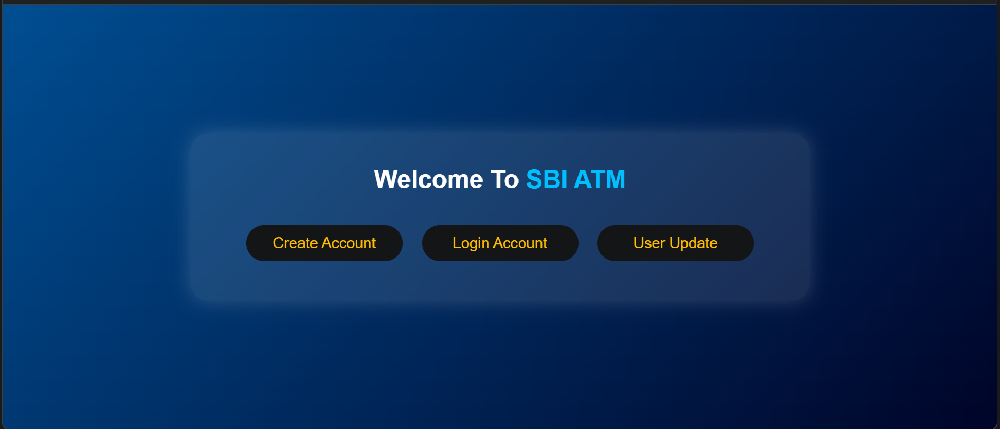
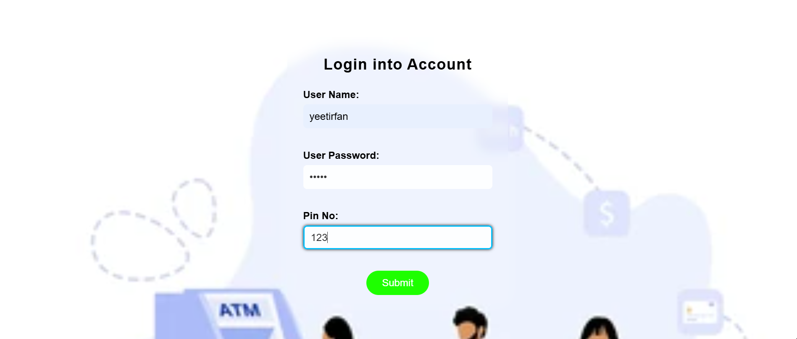
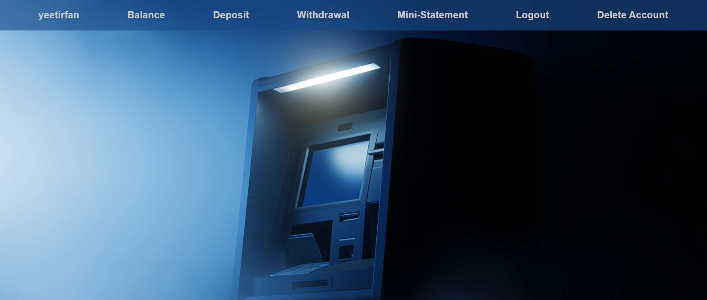
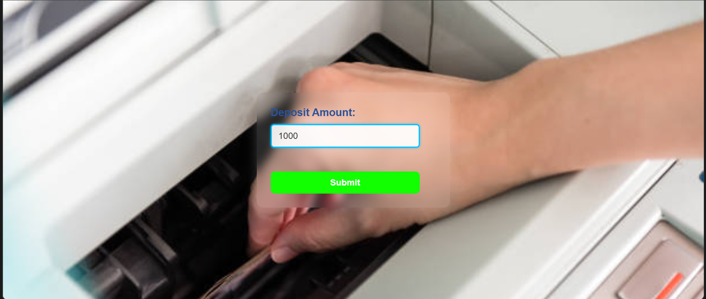
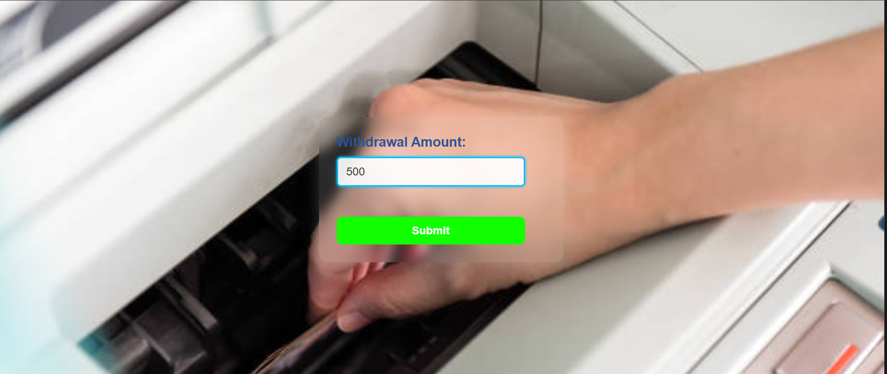

<h1 align="center">🏦 ATM_WEBAPP</h1>

<p align="center">
  <b>A Flask-based ATM Simulation Web Application</b><br>
  Create accounts, log in, deposit & withdraw money, view balances, and check mini-statements — all with a clean, responsive UI.
</p>

<p align="center">
  
  
  
  
  
</p>

---

## 📖 Overview

**ATM_WEBAPP** is a responsive **ATM Simulation System** built using **Flask**, **HTML**, **CSS**, and **JavaScript**.  
It mimics real-world ATM operations — allowing users to register, log in, deposit, withdraw, and view transaction statements.

Currently, it uses **in-memory storage**, with future updates planned for **MySQL database integration** to enable persistent user data and transaction history.

---

## 📸 Screenshots


| Page | Screenshot |
|------|-------------|
| 🧾 **Welcome Page** |  |
| 🧾 **Register Page** |  |
| 🔐 **Login Page** |  |
| 🏠 **Home Page** |  |
| 💰 **Deposit Page** |  |
| 💰 **Withdraw Page** |  |
| 📜 **Mini Statement** | [Mini Statement Page](static/assets/mini_statements.png)|
---

## 📁 Project Structure

ATM_WEBAPP/
│
├── app.py # Main Flask backend
├── requirements.txt # Python dependencies
├── vercel.json # Vercel deployment configuration
│
├── static/
│ ├── css/
│ │ ├── index.css # Landing page styles
│ │ ├── login.css # Login form
│ │ ├── register.css # Account creation
│ │ ├── home.css # Dashboard
│ │ ├── amount.css # Deposit/Withdraw
│ │ ├── balance.css # Balance display
│ │ └── statements.css # Mini statement table
│ │
│ └── assets/
│ ├── login.webp
│ ├── register.webp
│ ├── dashboard.png
│ └── deposit.jpg
│
├── templates/
│ ├── index.html
│ ├── Register.html
│ ├── login.html
│ ├── home.html
│ ├── deposit.html
│ ├── withdrawal.html
│ ├── balance.html
│ └── statement.html
│
└── README.md


---

## 🚀 Features

### 🔐 User Authentication

- Register with **username, email, password, and 4-digit PIN**
- Login verification using **password + PIN**
- Cookie-based session management

### 💰 Deposit

- Accepts multiples of ₹100 (max ₹50,000 per transaction)
- Validates user input and timestamps each deposit

### 💸 Withdraw

- Enforces ₹50,000 limit and ₹100 multiples rule
- Checks for sufficient balance before withdrawal

### 💳 Balance Check

- Displays the user’s available balance in real-time

### 📜 Mini Statements

- Displays complete deposit & withdrawal history with timestamps

### 🔒 Logout & Account Deletion

- Deletes session cookie on logout
- Allows full account removal (in-memory)

---

## ⚙️ Installation & Setup

### 1️⃣ Clone the repository

```bash
git clone https://github.com/<your-username>/ATM_WEBAPP.git
cd ATM_WEBAPP

2️⃣ Create & activate a virtual environment

# Windows
python -m venv venv
venv\Scripts\activate

# macOS/Linux
python3 -m venv venv
source venv/bin/activate

3️⃣ Install dependencies

pip install -r requirements.txt

4️⃣ Run the application

python app.py

5️⃣ Open in browser

http://127.0.0.1:5000/

🧠 Backend Overview

Current (In-Memory):

users = {}
statements = {}

Future (MySQL Integration)

| Table          | Description                                        |
| -------------- | -------------------------------------------------- |
| `users`        | Stores username, email, password, pin, and balance |
| `transactions` | Logs deposits & withdrawals with timestamps        |

🧩 Tech Stack

| Layer               | Technology              |
| ------------------- | ----------------------- |
| **Backend**         | Flask (Python)          |
| **Frontend**        | HTML5, CSS3, JavaScript |
| **Database (Next)** | MySQL                   |
| **Templating**      | Jinja2                  |
| **Session**         | Cookies                 |
| **Deployment**      | Vercel                  |

🪪 Requirements

blinker==1.9.0
click==8.3.0
colorama==0.4.6
Flask==3.1.2
itsdangerous==2.2.0
Jinja2==3.1.6
MarkupSafe==3.0.3
Werkzeug==3.1.3

Install using:
pip install -r requirements.txt

☁️ Deployment on Vercel

{
  "version": 2,
  "builds": [
    { "src": "app.py", "use": "@vercel/python" }
  ],
  "routes": [
    { "src": "/(.*)", "dest": "app.py" }
  ]
}

Steps

Push to GitHub

Connect the repository to Vercel

Vercel will auto-deploy your Flask app using app.py

🧠 Learning Objectives

Build full-stack apps using Flask

Manage routes, templates, and forms

Handle CRUD operations with MySQL (next update)

Design responsive UI with modular CSS

Use cookies for secure session handling

Deploy Flask apps using Vercel

👨‍💻 Author

Shaik Irfan
💻 Python & Flask Developer
📍 Tenali, Andhra Pradesh, India

🪪 License

This project is licensed under the MIT License.
Feel free to use, modify, and share with proper credit.

🌟 Future Roadmap

✅ Flask base version (in-memory)
🛠️ MySQL Integration via mysql-connector-python
🔐 Password encryption with bcrypt
📊 Admin dashboard for analytics
🧾 Transaction filters by date/type

💬 Feedback

If you find this project helpful, please ⭐ the repo on GitHub —
your support motivates the next version with full MySQL integration and secure authentication!
